IS-2 Donation Model
================
Clarice Muthoni Gitonga
25/10/2023

- [Student Details](#student-details)
- [Introduction](#introduction)
  - [1: Install and use renv](#1-install-and-use-renv)
  - [2: Loading the dataset](#2-loading-the-dataset)
  - [3: Preview Loaded Dataset](#3-preview-loaded-dataset)
    - [Dimensions](#dimensions)
    - [Data Types](#data-types)
- [Descriptive Statistics](#descriptive-statistics)
  - [A. Measures of frequency](#a-measures-of-frequency)
  - [B.Measures of Central Tendency](#bmeasures-of-central-tendency)
  - [C. Measure of distribution of the
    data](#c-measure-of-distribution-of-the-data)
    - [1. Summary of Distribution](#1-summary-of-distribution)
    - [2. Standard deviation](#2-standard-deviation)
    - [3. Measure of Variance](#3-measure-of-variance)
    - [4. Measure of Kurtosis](#4-measure-of-kurtosis)
    - [5. Measure of Skewness](#5-measure-of-skewness)
  - [D. Measures of Relationship](#d-measures-of-relationship)
    - [1. Measure the covariance between
      variables](#1-measure-the-covariance-between-variables)
    - [2. Measure the correlation between
      variables](#2-measure-the-correlation-between-variables)
- [Inferential Statistics](#inferential-statistics)
  - [ANOVA](#anova)
    - [(i) One-Way ANOVA](#i-one-way-anova)
    - [(ii) Two-Way ANOVA —-](#ii-two-way-anova--)
- [Basic Visualizations](#basic-visualizations)
  - [(i) Univariate Plots](#i-univariate-plots)
    - [Histograms for Each Numeric
      Attribute](#histograms-for-each-numeric-attribute)
    - [Box and Whisker Plots for Each Numeric
      Attribute](#box-and-whisker-plots-for-each-numeric-attribute)
    - [Bar Plots for Each Categorical
      Attribute](#bar-plots-for-each-categorical-attribute)
  - [(ii) Multivariate Plots](#ii-multivariate-plots)
    - [Correlation Plot](#correlation-plot)
    - [Create a Scatter Plot —-](#create-a-scatter-plot--)
    - [Multivariate Box and Whisker Plots by
      Class](#multivariate-box-and-whisker-plots-by-class)

# Student Details

|                       |                 |
|-----------------------|-----------------|
| **Student ID Number** | 127707          |
| **Student Name**      | Clarice Gitonga |
| **BBIT 4.2 Group**    | 4.2B            |
| **Supervisor**        | Selina Evelia   |

# Introduction

## 1: Install and use renv

``` r
renv::init()
```

    ## - The project is out-of-sync -- use `renv::status()` for details.

## 2: Loading the dataset

``` r
library(readr)
census <- read_csv("data/census.csv")
```

    ## Rows: 45222 Columns: 14
    ## ── Column specification ────────────────────────────────────────────────────────
    ## Delimiter: ","
    ## chr (9): workclass, education_level, marital-status, occupation, relationshi...
    ## dbl (5): age, education-num, capital-gain, capital-loss, hours-per-week
    ## 
    ## ℹ Use `spec()` to retrieve the full column specification for this data.
    ## ℹ Specify the column types or set `show_col_types = FALSE` to quiet this message.

``` r
View(census)
```

## 3: Preview Loaded Dataset

### Dimensions

Because the dataset is large and has 45222 rows and 14 columns, it will
be reduced to 1000 rows and 14 columns.

``` r
dim(census)
```

    ## [1] 45222    14

Reduce datasets

``` r
census2 <- census[sample(nrow(census), 1000), ]
View(census2)
```

Save as CSV

``` r
write.csv(census2, file = "C:/Users/clari/OneDrive/Desktop/API/BIProject/data/census2.csv", row.names = FALSE)
```

### Data Types

``` r
sapply(census2, class)
```

    ##             age       workclass education_level   education-num  marital-status 
    ##       "numeric"     "character"     "character"       "numeric"     "character" 
    ##      occupation    relationship            race             sex    capital-gain 
    ##     "character"     "character"     "character"     "character"       "numeric" 
    ##    capital-loss  hours-per-week  native-country          income 
    ##       "numeric"       "numeric"     "character"     "character"

# Descriptive Statistics

## A. Measures of frequency

``` r
census2_freq <- census2$income   # For Income
cbind(frequency = table(census2_freq),
      percentage = prop.table(table(census2_freq)) * 100)
```

    ##       frequency percentage
    ## <=50K       741       74.1
    ## >50K        259       25.9

``` r
census2_freq <- census2$relationship   # For Relationship
cbind(frequency = table(census2_freq),
      percentage = prop.table(table(census2_freq)) * 100)
```

    ##                frequency percentage
    ## Husband              418       41.8
    ## Not-in-family        247       24.7
    ## Other-relative        32        3.2
    ## Own-child            153       15.3
    ## Unmarried            108       10.8
    ## Wife                  42        4.2

``` r
census2_freq <- census2$occupation      # For Occupation
cbind(frequency = table(census2_freq),
      percentage = prop.table(table(census2_freq)) * 100)
```

    ##                   frequency percentage
    ## Adm-clerical            108       10.8
    ## Armed-Forces              1        0.1
    ## Craft-repair            130       13.0
    ## Exec-managerial         146       14.6
    ## Farming-fishing          33        3.3
    ## Handlers-cleaners        50        5.0
    ## Machine-op-inspct        67        6.7
    ## Other-service            97        9.7
    ## Priv-house-serv           5        0.5
    ## Prof-specialty          138       13.8
    ## Protective-serv          21        2.1
    ## Sales                   107       10.7
    ## Tech-support             32        3.2
    ## Transport-moving         65        6.5

``` r
census2_freq <- census2$workclass        # For workclass
cbind(frequency = table(census2_freq),
      percentage = prop.table(table(census2_freq)) * 100)
```

    ##                  frequency percentage
    ## Federal-gov             32        3.2
    ## Local-gov               78        7.8
    ## Private                727       72.7
    ## Self-emp-inc            33        3.3
    ## Self-emp-not-inc        92        9.2
    ## State-gov               36        3.6
    ## Without-pay              2        0.2

``` r
census2_freq <- census2$education_level   # For education_level
cbind(frequency = table(census2_freq),
      percentage = prop.table(table(census2_freq)) * 100)
```

    ##              frequency percentage
    ## 10th                22        2.2
    ## 11th                34        3.4
    ## 12th                16        1.6
    ## 1st-4th              6        0.6
    ## 5th-6th             14        1.4
    ## 7th-8th             21        2.1
    ## 9th                 13        1.3
    ## Assoc-acdm          30        3.0
    ## Assoc-voc           46        4.6
    ## Bachelors          164       16.4
    ## Doctorate            7        0.7
    ## HS-grad            322       32.2
    ## Masters             65        6.5
    ## Prof-school         24        2.4
    ## Some-college       216       21.6

``` r
census2_freq <- census2$`marital-status`   # For marital_status
cbind(frequency = table(census2_freq),
      percentage = prop.table(table(census2_freq)) * 100)
```

    ##                       frequency percentage
    ## Divorced                    149       14.9
    ## Married-AF-spouse             1        0.1
    ## Married-civ-spouse          469       46.9
    ## Married-spouse-absent         7        0.7
    ## Never-married               325       32.5
    ## Separated                    28        2.8
    ## Widowed                      21        2.1

``` r
census2_freq <- census2$sex   # For sex
cbind(frequency = table(census2_freq),
      percentage = prop.table(table(census2_freq)) * 100)
```

    ##        frequency percentage
    ## Female       316       31.6
    ## Male         684       68.4

``` r
census2_freq <- census2$race   # For race
cbind(frequency = table(census2_freq),
      percentage = prop.table(table(census2_freq)) * 100)
```

    ##                    frequency percentage
    ## Amer-Indian-Eskimo        11        1.1
    ## Asian-Pac-Islander        21        2.1
    ## Black                     89        8.9
    ## Other                      7        0.7
    ## White                    872       87.2

``` r
census2_freq <- census2$`native-country`   # For native_country
cbind(frequency = table(census2_freq),
      percentage = prop.table(table(census2_freq)) * 100)
```

    ##                    frequency percentage
    ## Cambodia                   1        0.1
    ## Canada                     9        0.9
    ## China                      4        0.4
    ## Columbia                   1        0.1
    ## Cuba                       5        0.5
    ## Dominican-Republic         1        0.1
    ## El-Salvador                3        0.3
    ## England                    4        0.4
    ## France                     1        0.1
    ## Germany                    6        0.6
    ## Greece                     1        0.1
    ## Guatemala                  4        0.4
    ## Haiti                      1        0.1
    ## Hungary                    1        0.1
    ## India                      2        0.2
    ## Ireland                    1        0.1
    ## Italy                      2        0.2
    ## Jamaica                    2        0.2
    ## Japan                      1        0.1
    ## Mexico                    19        1.9
    ## Nicaragua                  3        0.3
    ## Philippines                2        0.2
    ## Poland                     3        0.3
    ## Portugal                   2        0.2
    ## Puerto-Rico                1        0.1
    ## Scotland                   1        0.1
    ## Trinadad&Tobago            1        0.1
    ## United-States            916       91.6
    ## Vietnam                    2        0.2

## B.Measures of Central Tendency

Calculate the Mode

``` r
# For income
census2_income_mode <- names(table(census2$income))[      
  which(table(census2$income) == max(table(census2$income)))
]
print(census2_income_mode)
```

    ## [1] "<=50K"

``` r
# For age
census2_age_mode <- names(table(census2$age))[      
  which(table(census2$age) == max(table(census2$age)))
]
print(census2_age_mode)
```

    ## [1] "36"

## C. Measure of distribution of the data

### 1. Summary of Distribution

``` r
summary(census2)
```

    ##       age         workclass         education_level    education-num  
    ##  Min.   :17.00   Length:1000        Length:1000        Min.   : 2.00  
    ##  1st Qu.:29.00   Class :character   Class :character   1st Qu.: 9.00  
    ##  Median :38.00   Mode  :character   Mode  :character   Median :10.00  
    ##  Mean   :39.06                                         Mean   :10.14  
    ##  3rd Qu.:48.00                                         3rd Qu.:13.00  
    ##  Max.   :90.00                                         Max.   :16.00  
    ##  marital-status      occupation        relationship           race          
    ##  Length:1000        Length:1000        Length:1000        Length:1000       
    ##  Class :character   Class :character   Class :character   Class :character  
    ##  Mode  :character   Mode  :character   Mode  :character   Mode  :character  
    ##                                                                             
    ##                                                                             
    ##                                                                             
    ##      sex             capital-gain    capital-loss     hours-per-week 
    ##  Length:1000        Min.   :    0   Min.   :   0.00   Min.   : 1.00  
    ##  Class :character   1st Qu.:    0   1st Qu.:   0.00   1st Qu.:40.00  
    ##  Mode  :character   Median :    0   Median :   0.00   Median :40.00  
    ##                     Mean   : 1558   Mean   :  87.85   Mean   :41.29  
    ##                     3rd Qu.:    0   3rd Qu.:   0.00   3rd Qu.:45.00  
    ##                     Max.   :99999   Max.   :2415.00   Max.   :99.00  
    ##  native-country        income         
    ##  Length:1000        Length:1000       
    ##  Class :character   Class :character  
    ##  Mode  :character   Mode  :character  
    ##                                       
    ##                                       
    ## 

### 2. Standard deviation

``` r
sapply(census[,c(1,4,10,11,12)], sd)
```

    ##            age  education-num   capital-gain   capital-loss hours-per-week 
    ##      13.217870       2.552881    7506.430084     404.956092      12.007508

### 3. Measure of Variance

``` r
sapply(census[,c(1,4,10,11,12)], var)
```

    ##            age  education-num   capital-gain   capital-loss hours-per-week 
    ##   1.747121e+02   6.517202e+00   5.634649e+07   1.639894e+05   1.441803e+02

### 4. Measure of Kurtosis

capital-gain, capital-loss and hours-per-week have a high number of
outliers.

``` r
if (!is.element("e1071", installed.packages()[, 1])) {
  install.packages("e1071", dependencies = TRUE)
}
require("e1071")
```

    ## Loading required package: e1071

``` r
sapply(census[,c(1,4,10,11,12)], kurtosis, type = 2)
```

    ##            age  education-num   capital-gain   capital-loss hours-per-week 
    ##     -0.1558745      0.6351236    150.1512923     19.3639695      3.2014249

### 5. Measure of Skewness

Skewness above 0.4 implies a positive skew; a right-skewed distribution.
(age, capital-gain, capital-loss)

Skewness below -0.4 implies a negative skew; a left-skewed
distribution.(hours-per-week)

``` r
sapply(census[,c(1,4,10,11,12)], skewness, type = 2)
```

    ##            age  education-num   capital-gain   capital-loss hours-per-week 
    ##      0.5328159     -0.3106209     11.7890022      4.5163042      0.3405451

## D. Measures of Relationship

### 1. Measure the covariance between variables

``` r
census2_cov <- cov(census2[, c(1,4,10,11,12)])
View(census2_cov)
```

### 2. Measure the correlation between variables

``` r
census2_cor <- cor(census2[, c(1,4,10,11,12)])
View(census2_cor) 
```

# Inferential Statistics

### ANOVA

Dependent variable: Income. Independent variables: age, workclass,
education_level, education-num, marital-status, occupation,
relationship, race, sex, capital-gain, capital-loss, hours-per-week,
native-country.

#### (i) One-Way ANOVA

``` r
result_one_way <- aov(`hours-per-week` ~ education_level, data = census2)
summary(result_one_way)
```

    ##                  Df Sum Sq Mean Sq F value   Pr(>F)    
    ## education_level  14  13613   972.4   6.297 3.39e-12 ***
    ## Residuals       985 152100   154.4                     
    ## ---
    ## Signif. codes:  0 '***' 0.001 '**' 0.01 '*' 0.05 '.' 0.1 ' ' 1

#### (ii) Two-Way ANOVA —-

``` r
result_two_way <- aov(`hours-per-week` ~ education_level * `marital-status`, data = census2)
summary(result_two_way)
```

    ##                                   Df Sum Sq Mean Sq F value   Pr(>F)    
    ## education_level                   14  13613   972.4   6.713 3.62e-13 ***
    ## `marital-status`                   6  10594  1765.7  12.190 3.14e-13 ***
    ## education_level:`marital-status`  47   6506   138.4   0.956    0.559    
    ## Residuals                        932 135000   144.8                     
    ## ---
    ## Signif. codes:  0 '***' 0.001 '**' 0.01 '*' 0.05 '.' 0.1 ' ' 1

# Basic Visualizations

## (i) Univariate Plots

### Histograms for Each Numeric Attribute

``` r
# Age
age <- as.numeric(unlist(census2[, 1]))
hist(age, main = names(census2)[1])
```

<!-- -->

``` r
# Education-num
`education-num` <- as.numeric(unlist(census2[, 4]))
hist(`education-num`, main = names(census2)[4])
```

<!-- -->

``` r
# Capital-gain
`capital-gain` <- as.numeric(unlist(census2[, 10]))
hist(`capital-gain`, main = names(census2)[10])
```

<!-- -->

``` r
# Capital-loss
`capital-loss` <- as.numeric(unlist(census2[, 11]))
hist(`capital-loss`, main = names(census2)[11])
```

<!-- -->

``` r
# hours-per-week
`hours-per-week` <- as.numeric(unlist(census2[, 12]))
hist(`hours-per-week`, main = names(census2)[12])
```

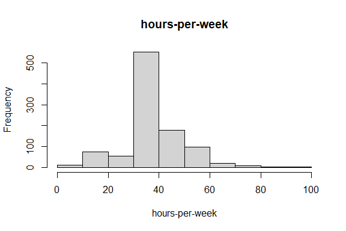<!-- -->

### Box and Whisker Plots for Each Numeric Attribute

``` r
boxplot(census2[, 1], main = names(census2)[1])
```

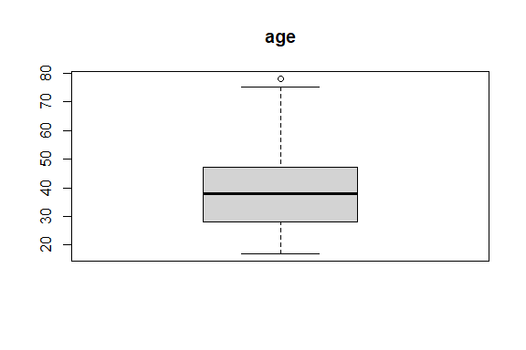<!-- -->

``` r
boxplot(census2[, 4], main = names(census2)[4])
```

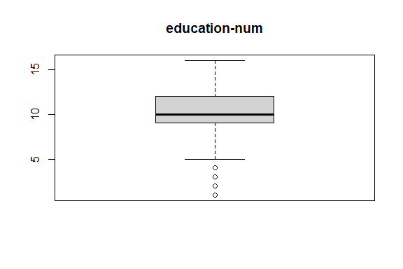<!-- -->

``` r
boxplot(census2[, 10], main = names(census2)[10])
```

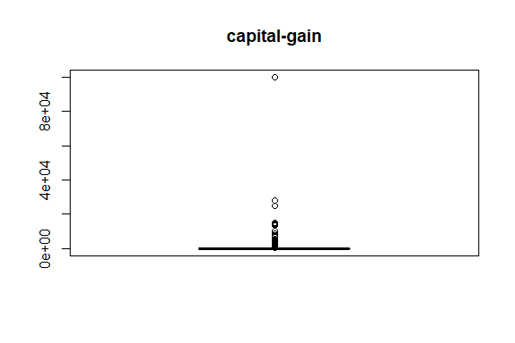<!-- -->

``` r
boxplot(census2[, 11], main = names(census2)[11])
```

<!-- -->

``` r
boxplot(census2[, 12], main = names(census2)[12])
```

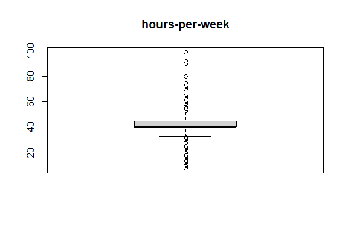<!-- -->

### Bar Plots for Each Categorical Attribute

``` r
barplot(table(census2[, 2]), main = names(census2)[2])
```

<!-- -->

``` r
barplot(table(census2[, 3]), main = names(census2)[3])
```

<!-- -->

``` r
barplot(table(census2[, 5]), main = names(census2)[5])
```

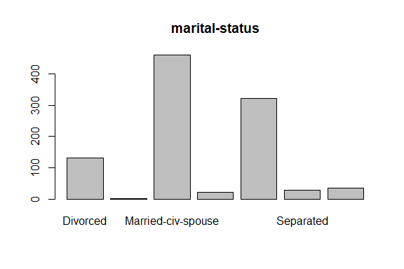<!-- -->

``` r
barplot(table(census2[, 6]), main = names(census2)[6])
```

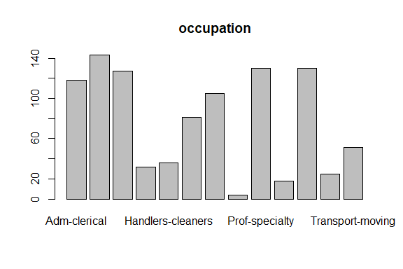<!-- -->

``` r
barplot(table(census2[, 7]), main = names(census2)[7])
```

<!-- -->

``` r
barplot(table(census2[, 8]), main = names(census2)[8])
```

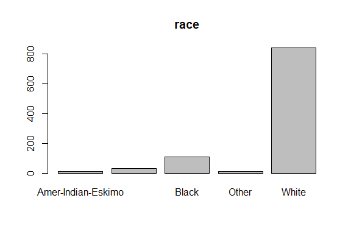<!-- -->

``` r
barplot(table(census2[, 9]), main = names(census2)[9])
```

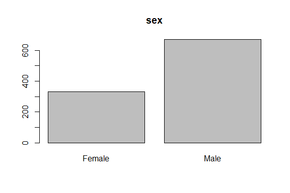<!-- -->

``` r
barplot(table(census2[, 13]), main = names(census2)[13])
```

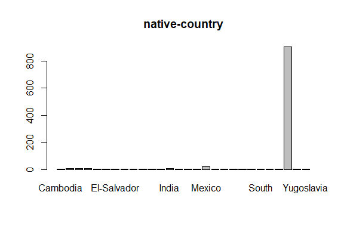<!-- -->

``` r
barplot(table(census2[, 14]), main = names(census2)[14])
```

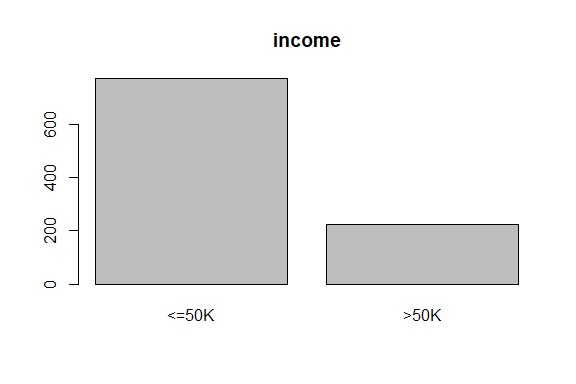<!-- -->

## (ii) Multivariate Plots

``` r
# ggplot
if (!is.element("ggcorrplot", installed.packages()[, 1])) {
  install.packages("ggcorrplot", dependencies = TRUE)
}
require("ggcorrplot")
```

    ## Loading required package: ggcorrplot

    ## Loading required package: ggplot2

``` r
# caret
if (!is.element("caret", installed.packages()[, 1])) {
  install.packages("caret", dependencies = TRUE)
}
require("caret")
```

    ## Loading required package: caret

    ## Loading required package: lattice

``` r
# listenv
if (!requireNamespace("listenv", quietly = TRUE)) {
  install.packages("listenv", dependencies = TRUE)
}
library(listenv)

# parallelly
if (!requireNamespace("parallelly", quietly = TRUE)) {
  install.packages("parallelly", dependencies = TRUE)
}
library(parallelly)

# globals
if (!is.element("globals", installed.packages()[, 1])) {
  install.packages("globals", dependencies = TRUE)
}
library(globals)
```

#### Correlation Plot

``` r
ggcorrplot(cor(census2[,c(1,4,10,11,12)]))
```

<!-- -->

#### Create a Scatter Plot —-

``` r
pairs(~ age  + `education-num` + `hours-per-week`, data = census2, col = as.numeric(factor(census2$income)))
```

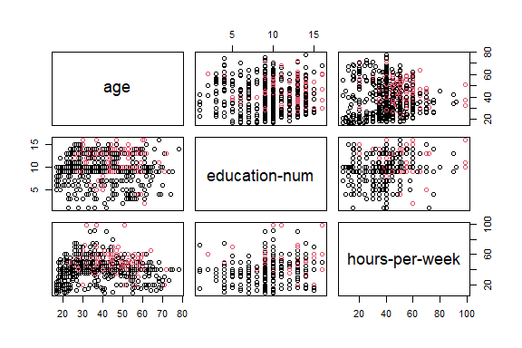<!-- -->

``` r
# Alternatively, the ggcorrplot package can be used to make the plots more
# appealing:
ggplot(census2,
       aes(x = `hours-per-week`, y = `marital-status`, shape = income, color = income)) +
  geom_point() +
  geom_smooth(method = lm)
```

    ## `geom_smooth()` using formula = 'y ~ x'

    ## Warning in qt((1 - level)/2, df): NaNs produced

    ## Warning in qt((1 - level)/2, df): NaNs produced

    ## Warning in max(ids, na.rm = TRUE): no non-missing arguments to max; returning
    ## -Inf

    ## Warning in max(ids, na.rm = TRUE): no non-missing arguments to max; returning
    ## -Inf

<!-- -->

### Multivariate Box and Whisker Plots by Class

``` r
featurePlot(x = census2[, c(1,4,10,11,12)], y = census2[, 14], plot = "box")
```

    ## NULL
