IS-2 Donation Model
================
Clarice Muthoni Gitonga
18/11/2023

- [Student Details](#student-details)
- [Introduction to Milestone 2](#introduction-to-milestone-2)
  - [1: Install and use renv](#1-install-and-use-renv)
  - [2: Loading the dataset](#2-loading-the-dataset)
- [Missingness Map to Identify Missing
  Data](#missingness-map-to-identify-missing-data)
- [Data Transforms](#data-transforms)
  - [Basic data transforms](#basic-data-transforms)
    - [(i) Scale Data Transform](#i-scale-data-transform)
    - [(ii) Centering Data Transform](#ii-centering-data-transform)
    - [(iii) Standardization](#iii-standardization)
    - [(iv) Normalization](#iv-normalization)
  - [Power transforms](#power-transforms)
    - [(i)Yeo-Johnson](#iyeo-johnson)
  - [Linear algebra transforms](#linear-algebra-transforms)
    - [(i) Principal Component Analysis
      (PCA)](#i-principal-component-analysis-pca)
      - [PCA for Feature Extraction](#pca-for-feature-extraction)
      - [Scree Plot](#scree-plot)
      - [Biplot and Cos2 Combined Plot](#biplot-and-cos2-combined-plot)
    - [(ii) Independent Component Analysis
      (ICA)](#ii-independent-component-analysis-ica)

# Student Details

|                       |                 |
|-----------------------|-----------------|
| **Student ID Number** | 127707          |
| **Student Name**      | Clarice Gitonga |
| **BBIT 4.2 Group**    | 4.2B            |
| **Supervisor**        | Selina Evelia   |

# Introduction to Milestone 2

## 1: Install and use renv

``` r
renv::init()
```

    ## - The project is out-of-sync -- use `renv::status()` for details.

## 2: Loading the dataset

``` r
library(readr)
census <- read_csv("data/census.csv")
```

    ## Rows: 45222 Columns: 14
    ## ── Column specification ────────────────────────────────────────────────────────
    ## Delimiter: ","
    ## chr (9): workclass, education_level, marital-status, occupation, relationshi...
    ## dbl (5): age, education-num, capital-gain, capital-loss, hours-per-week
    ## 
    ## ℹ Use `spec()` to retrieve the full column specification for this data.
    ## ℹ Specify the column types or set `show_col_types = FALSE` to quiet this message.

``` r
View(census)

# Reduce datasets
census2 <- census[sample(nrow(census), 1000), ]
View(census2)

# Save as CSV
write.csv(census2, file = "C:/Users/clari/OneDrive/Desktop/API/BIProject/data/census2.csv", row.names = FALSE)
```

# Missingness Map to Identify Missing Data

There was no missing data.

``` r
# Amelia 
if (!is.element("Amelia", installed.packages()[, 1])) {
  install.packages("Amelia", dependencies = TRUE)
}
require("Amelia")
```

    ## Loading required package: Amelia

    ## Loading required package: Rcpp

    ## ## 
    ## ## Amelia II: Multiple Imputation
    ## ## (Version 1.8.1, built: 2022-11-18)
    ## ## Copyright (C) 2005-2023 James Honaker, Gary King and Matthew Blackwell
    ## ## Refer to http://gking.harvard.edu/amelia/ for more information
    ## ##

``` r
missmap(census2, col = c("red", "grey"), legend = TRUE)
```

    ## Warning: Unknown or uninitialised column: `arguments`.
    ## Unknown or uninitialised column: `arguments`.

    ## Warning: Unknown or uninitialised column: `imputations`.

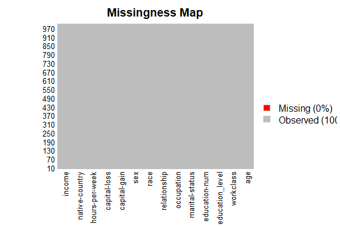<!-- -->

# Data Transforms

Data transforms can improve the accuracy of your final model when
applied as part of the pre-processing stage.

``` r
## Install and Load the Required Packages
## mlbench
if (require("mlbench")) {
  require("mlbench")
} else {
  install.packages("mlbench", dependencies = TRUE,
                   repos = "https://cloud.r-project.org")
}
```

    ## Loading required package: mlbench

``` r
## readr
if (require("readr")) {
  require("readr")
} else {
  install.packages("readr", dependencies = TRUE,
                   repos = "https://cloud.r-project.org")
}

## caret
if (require("caret")) {
  require("caret")
} else {
  install.packages("caret", dependencies = TRUE,
                   repos = "https://cloud.r-project.org")
}
```

    ## Loading required package: caret

    ## Loading required package: ggplot2

    ## Loading required package: lattice

``` r
## e1071
if (require("e1071")) {
  require("e1071")
} else {
  install.packages("e1071", dependencies = TRUE,
                   repos = "https://cloud.r-project.org")
}
```

    ## Loading required package: e1071

``` r
## factoextra
if (require("factoextra")) {
  require("factoextra")
} else {
  install.packages("factoextra", dependencies = TRUE,
                   repos = "https://cloud.r-project.org")
}
```

    ## Loading required package: factoextra

    ## Warning: package 'factoextra' was built under R version 4.3.2

    ## Welcome! Want to learn more? See two factoextra-related books at https://goo.gl/ve3WBa

``` r
## FactoMineR
if (require("FactoMineR")) {
  require("FactoMineR")
} else {
  install.packages("FactoMineR", dependencies = TRUE,
                   repos = "https://cloud.r-project.org")
}
```

    ## Loading required package: FactoMineR

    ## Warning: package 'FactoMineR' was built under R version 4.3.2

## Basic data transforms

### (i) Scale Data Transform

``` r
# BEFORE
summary(census2)
```

    ##       age         workclass         education_level    education-num   
    ##  Min.   :17.00   Length:1000        Length:1000        Min.   : 1.000  
    ##  1st Qu.:27.00   Class :character   Class :character   1st Qu.: 9.000  
    ##  Median :37.00   Mode  :character   Mode  :character   Median :10.000  
    ##  Mean   :38.09                                         Mean   : 9.987  
    ##  3rd Qu.:46.00                                         3rd Qu.:12.000  
    ##  Max.   :90.00                                         Max.   :16.000  
    ##  marital-status      occupation        relationship           race          
    ##  Length:1000        Length:1000        Length:1000        Length:1000       
    ##  Class :character   Class :character   Class :character   Class :character  
    ##  Mode  :character   Mode  :character   Mode  :character   Mode  :character  
    ##                                                                             
    ##                                                                             
    ##                                                                             
    ##      sex             capital-gain      capital-loss     hours-per-week 
    ##  Length:1000        Min.   :    0.0   Min.   :   0.00   Min.   : 3.00  
    ##  Class :character   1st Qu.:    0.0   1st Qu.:   0.00   1st Qu.:40.00  
    ##  Mode  :character   Median :    0.0   Median :   0.00   Median :40.00  
    ##                     Mean   :  924.4   Mean   :  70.56   Mean   :41.06  
    ##                     3rd Qu.:    0.0   3rd Qu.:   0.00   3rd Qu.:45.00  
    ##                     Max.   :99999.0   Max.   :2824.00   Max.   :99.00  
    ##  native-country        income         
    ##  Length:1000        Length:1000       
    ##  Class :character   Class :character  
    ##  Mode  :character   Mode  :character  
    ##                                       
    ##                                       
    ## 

``` r
# Age
age <- as.numeric(unlist(census2[, 1]))
hist(age, main = names(census2)[1])
```

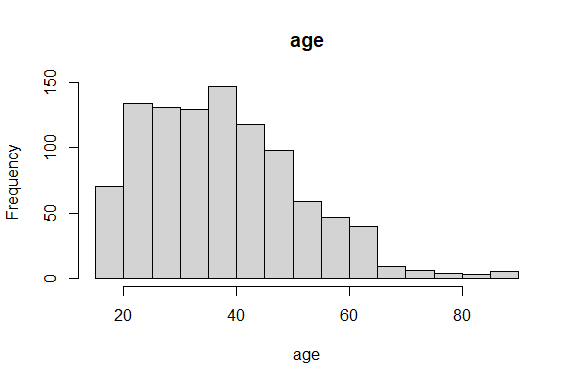<!-- -->

``` r
# Education-num
`education-num` <- as.numeric(unlist(census2[, 4]))
hist(`education-num`, main = names(census2)[4])
```

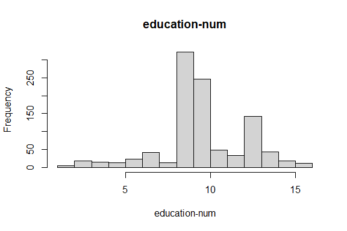<!-- -->

``` r
# Capital-gain
`capital-gain` <- as.numeric(unlist(census2[, 10]))
hist(`capital-gain`, main = names(census2)[10])
```

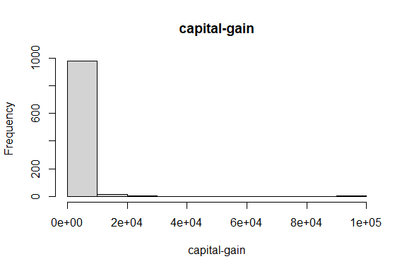<!-- -->

``` r
# Capital-loss
`capital-loss` <- as.numeric(unlist(census2[, 11]))
hist(`capital-loss`, main = names(census2)[11])
```

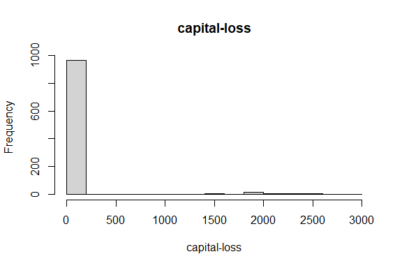<!-- -->

``` r
# hours-per-week
`hours-per-week` <- as.numeric(unlist(census2[, 12]))
hist(`hours-per-week`, main = names(census2)[12])
```

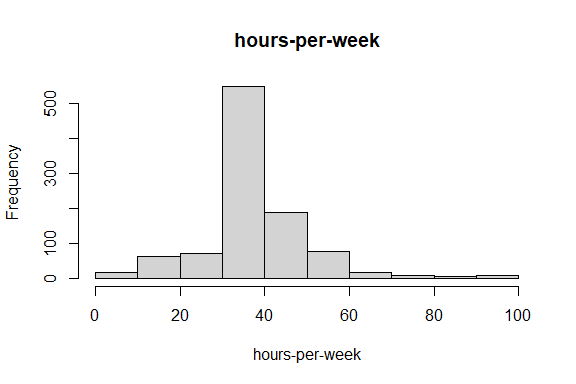<!-- -->

``` r
model_of_the_transform <- preProcess(census2, method = c("scale"))
print(model_of_the_transform)
```

    ## Created from 1000 samples and 14 variables
    ## 
    ## Pre-processing:
    ##   - ignored (9)
    ##   - scaled (5)

``` r
census2_scale_transform <- predict(model_of_the_transform,
                                          census2)

# AFTER
summary(census2_scale_transform )
```

    ##       age         workclass         education_level    education-num   
    ##  Min.   :1.260   Length:1000        Length:1000        Min.   :0.3965  
    ##  1st Qu.:2.001   Class :character   Class :character   1st Qu.:3.5684  
    ##  Median :2.743   Mode  :character   Mode  :character   Median :3.9649  
    ##  Mean   :2.823                                         Mean   :3.9597  
    ##  3rd Qu.:3.410                                         3rd Qu.:4.7579  
    ##  Max.   :6.671                                         Max.   :6.3438  
    ##  marital-status      occupation        relationship           race          
    ##  Length:1000        Length:1000        Length:1000        Length:1000       
    ##  Class :character   Class :character   Class :character   Class :character  
    ##  Mode  :character   Mode  :character   Mode  :character   Mode  :character  
    ##                                                                             
    ##                                                                             
    ##                                                                             
    ##      sex             capital-gain      capital-loss    hours-per-week  
    ##  Length:1000        Min.   : 0.0000   Min.   :0.0000   Min.   :0.2339  
    ##  Class :character   1st Qu.: 0.0000   1st Qu.:0.0000   1st Qu.:3.1181  
    ##  Mode  :character   Median : 0.0000   Median :0.0000   Median :3.1181  
    ##                     Mean   : 0.1382   Mean   :0.1879   Mean   :3.2007  
    ##                     3rd Qu.: 0.0000   3rd Qu.:0.0000   3rd Qu.:3.5079  
    ##                     Max.   :14.9510   Max.   :7.5213   Max.   :7.7174  
    ##  native-country        income         
    ##  Length:1000        Length:1000       
    ##  Class :character   Class :character  
    ##  Mode  :character   Mode  :character  
    ##                                       
    ##                                       
    ## 

``` r
# Age
hist(census2_scale_transform$age, main = names(census2_scale_transform)[which(names(census2_scale_transform) == 'age')])
```

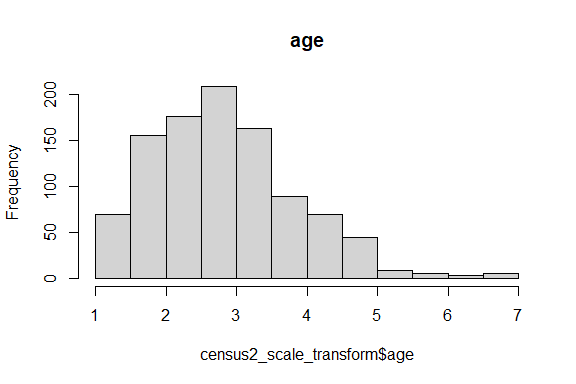<!-- -->

``` r
# Education-num
hist(census2_scale_transform$`education-num`, main = names(census2_scale_transform)[which(names(census2_scale_transform) == 'education-num')])
```

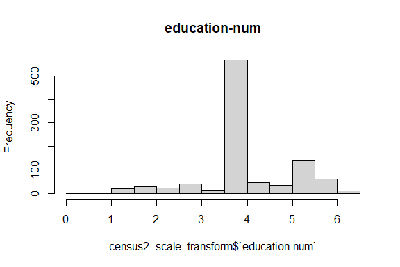<!-- -->

``` r
# Capital-gain
hist(census2_scale_transform$`capital-gain`, main = names(census2_scale_transform)[which(names(census2_scale_transform) == 'capital-gain')])
```

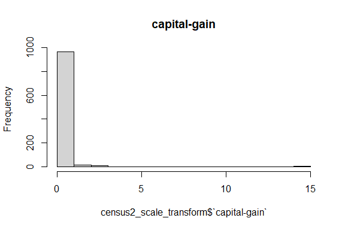<!-- -->

``` r
# Capital-loss
hist(census2_scale_transform$`capital-loss`, main = names(census2_scale_transform)[which(names(census2_scale_transform) == 'capital-loss')])
```

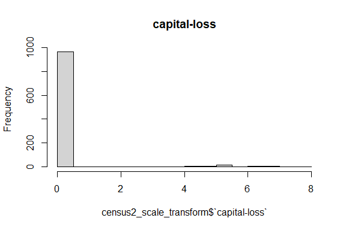<!-- -->

``` r
# hours-per-week
hist(census2_scale_transform$`hours-per-week`, main = names(census2_scale_transform)[which(names(census2_scale_transform) == 'hours-per-week')])
```

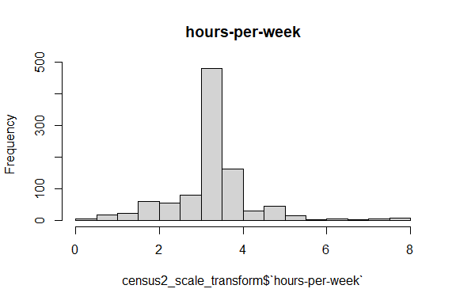<!-- -->

### (ii) Centering Data Transform

``` r
summary(census2)
```

    ##       age         workclass         education_level    education-num   
    ##  Min.   :17.00   Length:1000        Length:1000        Min.   : 1.000  
    ##  1st Qu.:27.00   Class :character   Class :character   1st Qu.: 9.000  
    ##  Median :37.00   Mode  :character   Mode  :character   Median :10.000  
    ##  Mean   :38.09                                         Mean   : 9.987  
    ##  3rd Qu.:46.00                                         3rd Qu.:12.000  
    ##  Max.   :90.00                                         Max.   :16.000  
    ##  marital-status      occupation        relationship           race          
    ##  Length:1000        Length:1000        Length:1000        Length:1000       
    ##  Class :character   Class :character   Class :character   Class :character  
    ##  Mode  :character   Mode  :character   Mode  :character   Mode  :character  
    ##                                                                             
    ##                                                                             
    ##                                                                             
    ##      sex             capital-gain      capital-loss     hours-per-week 
    ##  Length:1000        Min.   :    0.0   Min.   :   0.00   Min.   : 3.00  
    ##  Class :character   1st Qu.:    0.0   1st Qu.:   0.00   1st Qu.:40.00  
    ##  Mode  :character   Median :    0.0   Median :   0.00   Median :40.00  
    ##                     Mean   :  924.4   Mean   :  70.56   Mean   :41.06  
    ##                     3rd Qu.:    0.0   3rd Qu.:   0.00   3rd Qu.:45.00  
    ##                     Max.   :99999.0   Max.   :2824.00   Max.   :99.00  
    ##  native-country        income         
    ##  Length:1000        Length:1000       
    ##  Class :character   Class :character  
    ##  Mode  :character   Mode  :character  
    ##                                       
    ##                                       
    ## 

``` r
model_of_the_transform <- preProcess(census2, method = c("center"))
print(model_of_the_transform)
```

    ## Created from 1000 samples and 14 variables
    ## 
    ## Pre-processing:
    ##   - centered (5)
    ##   - ignored (9)

``` r
census2_center_transform <- predict(model_of_the_transform, census2)
summary(census2_center_transform)
```

    ##       age           workclass         education_level    education-num   
    ##  Min.   :-21.085   Length:1000        Length:1000        Min.   :-8.987  
    ##  1st Qu.:-11.085   Class :character   Class :character   1st Qu.:-0.987  
    ##  Median : -1.085   Mode  :character   Mode  :character   Median : 0.013  
    ##  Mean   :  0.000                                         Mean   : 0.000  
    ##  3rd Qu.:  7.915                                         3rd Qu.: 2.013  
    ##  Max.   : 51.915                                         Max.   : 6.013  
    ##  marital-status      occupation        relationship           race          
    ##  Length:1000        Length:1000        Length:1000        Length:1000       
    ##  Class :character   Class :character   Class :character   Class :character  
    ##  Mode  :character   Mode  :character   Mode  :character   Mode  :character  
    ##                                                                             
    ##                                                                             
    ##                                                                             
    ##      sex             capital-gain      capital-loss     hours-per-week   
    ##  Length:1000        Min.   : -924.4   Min.   : -70.56   Min.   :-38.059  
    ##  Class :character   1st Qu.: -924.4   1st Qu.: -70.56   1st Qu.: -1.059  
    ##  Mode  :character   Median : -924.4   Median : -70.56   Median : -1.059  
    ##                     Mean   :    0.0   Mean   :   0.00   Mean   :  0.000  
    ##                     3rd Qu.: -924.4   3rd Qu.: -70.56   3rd Qu.:  3.941  
    ##                     Max.   :99074.6   Max.   :2753.44   Max.   : 57.941  
    ##  native-country        income         
    ##  Length:1000        Length:1000       
    ##  Class :character   Class :character  
    ##  Mode  :character   Mode  :character  
    ##                                       
    ##                                       
    ## 

### (iii) Standardization

``` r
summary(census2)
```

    ##       age         workclass         education_level    education-num   
    ##  Min.   :17.00   Length:1000        Length:1000        Min.   : 1.000  
    ##  1st Qu.:27.00   Class :character   Class :character   1st Qu.: 9.000  
    ##  Median :37.00   Mode  :character   Mode  :character   Median :10.000  
    ##  Mean   :38.09                                         Mean   : 9.987  
    ##  3rd Qu.:46.00                                         3rd Qu.:12.000  
    ##  Max.   :90.00                                         Max.   :16.000  
    ##  marital-status      occupation        relationship           race          
    ##  Length:1000        Length:1000        Length:1000        Length:1000       
    ##  Class :character   Class :character   Class :character   Class :character  
    ##  Mode  :character   Mode  :character   Mode  :character   Mode  :character  
    ##                                                                             
    ##                                                                             
    ##                                                                             
    ##      sex             capital-gain      capital-loss     hours-per-week 
    ##  Length:1000        Min.   :    0.0   Min.   :   0.00   Min.   : 3.00  
    ##  Class :character   1st Qu.:    0.0   1st Qu.:   0.00   1st Qu.:40.00  
    ##  Mode  :character   Median :    0.0   Median :   0.00   Median :40.00  
    ##                     Mean   :  924.4   Mean   :  70.56   Mean   :41.06  
    ##                     3rd Qu.:    0.0   3rd Qu.:   0.00   3rd Qu.:45.00  
    ##                     Max.   :99999.0   Max.   :2824.00   Max.   :99.00  
    ##  native-country        income         
    ##  Length:1000        Length:1000       
    ##  Class :character   Class :character  
    ##  Mode  :character   Mode  :character  
    ##                                       
    ##                                       
    ## 

``` r
# BEFORE
sapply(census[,c(1,4,10,11,12)], sd)
```

    ##            age  education-num   capital-gain   capital-loss hours-per-week 
    ##      13.217870       2.552881    7506.430084     404.956092      12.007508

``` r
model_of_the_transform <- preProcess(census2,
                                     method = c("scale", "center"))
print(model_of_the_transform)
```

    ## Created from 1000 samples and 14 variables
    ## 
    ## Pre-processing:
    ##   - centered (5)
    ##   - ignored (9)
    ##   - scaled (5)

``` r
census2_standardize_transform <- predict(model_of_the_transform, census2)
# AFTER
summary(census2_standardize_transform)
```

    ##       age            workclass         education_level    education-num      
    ##  Min.   :-1.56286   Length:1000        Length:1000        Min.   :-3.563243  
    ##  1st Qu.:-0.82164   Class :character   Class :character   1st Qu.:-0.391334  
    ##  Median :-0.08042   Mode  :character   Mode  :character   Median : 0.005154  
    ##  Mean   : 0.00000                                         Mean   : 0.000000  
    ##  3rd Qu.: 0.58668                                         3rd Qu.: 0.798132  
    ##  Max.   : 3.84805                                         Max.   : 2.384086  
    ##  marital-status      occupation        relationship           race          
    ##  Length:1000        Length:1000        Length:1000        Length:1000       
    ##  Class :character   Class :character   Class :character   Class :character  
    ##  Mode  :character   Mode  :character   Mode  :character   Mode  :character  
    ##                                                                             
    ##                                                                             
    ##                                                                             
    ##      sex             capital-gain      capital-loss     hours-per-week    
    ##  Length:1000        Min.   :-0.1382   Min.   :-0.1879   Min.   :-2.96683  
    ##  Class :character   1st Qu.:-0.1382   1st Qu.:-0.1879   1st Qu.:-0.08255  
    ##  Mode  :character   Median :-0.1382   Median :-0.1879   Median :-0.08255  
    ##                     Mean   : 0.0000   Mean   : 0.0000   Mean   : 0.00000  
    ##                     3rd Qu.:-0.1382   3rd Qu.:-0.1879   3rd Qu.: 0.30721  
    ##                     Max.   :14.8128   Max.   : 7.3334   Max.   : 4.51670  
    ##  native-country        income         
    ##  Length:1000        Length:1000       
    ##  Class :character   Class :character  
    ##  Mode  :character   Mode  :character  
    ##                                       
    ##                                       
    ## 

``` r
sapply(census2_standardize_transform[,c(1,4,10,11,12)], sd)
```

    ##            age  education-num   capital-gain   capital-loss hours-per-week 
    ##              1              1              1              1              1

### (iv) Normalization

``` r
summary(census2)
```

    ##       age         workclass         education_level    education-num   
    ##  Min.   :17.00   Length:1000        Length:1000        Min.   : 1.000  
    ##  1st Qu.:27.00   Class :character   Class :character   1st Qu.: 9.000  
    ##  Median :37.00   Mode  :character   Mode  :character   Median :10.000  
    ##  Mean   :38.09                                         Mean   : 9.987  
    ##  3rd Qu.:46.00                                         3rd Qu.:12.000  
    ##  Max.   :90.00                                         Max.   :16.000  
    ##  marital-status      occupation        relationship           race          
    ##  Length:1000        Length:1000        Length:1000        Length:1000       
    ##  Class :character   Class :character   Class :character   Class :character  
    ##  Mode  :character   Mode  :character   Mode  :character   Mode  :character  
    ##                                                                             
    ##                                                                             
    ##                                                                             
    ##      sex             capital-gain      capital-loss     hours-per-week 
    ##  Length:1000        Min.   :    0.0   Min.   :   0.00   Min.   : 3.00  
    ##  Class :character   1st Qu.:    0.0   1st Qu.:   0.00   1st Qu.:40.00  
    ##  Mode  :character   Median :    0.0   Median :   0.00   Median :40.00  
    ##                     Mean   :  924.4   Mean   :  70.56   Mean   :41.06  
    ##                     3rd Qu.:    0.0   3rd Qu.:   0.00   3rd Qu.:45.00  
    ##                     Max.   :99999.0   Max.   :2824.00   Max.   :99.00  
    ##  native-country        income         
    ##  Length:1000        Length:1000       
    ##  Class :character   Class :character  
    ##  Mode  :character   Mode  :character  
    ##                                       
    ##                                       
    ## 

``` r
model_of_the_transform <- preProcess(census2, method = c("range"))
print(model_of_the_transform)
```

    ## Created from 1000 samples and 14 variables
    ## 
    ## Pre-processing:
    ##   - ignored (9)
    ##   - re-scaling to [0, 1] (5)

``` r
census2_normalize_transform <- predict(model_of_the_transform, census2)
summary(census2_normalize_transform)
```

    ##       age          workclass         education_level    education-num   
    ##  Min.   :0.0000   Length:1000        Length:1000        Min.   :0.0000  
    ##  1st Qu.:0.1370   Class :character   Class :character   1st Qu.:0.5333  
    ##  Median :0.2740   Mode  :character   Mode  :character   Median :0.6000  
    ##  Mean   :0.2888                                         Mean   :0.5991  
    ##  3rd Qu.:0.3973                                         3rd Qu.:0.7333  
    ##  Max.   :1.0000                                         Max.   :1.0000  
    ##  marital-status      occupation        relationship           race          
    ##  Length:1000        Length:1000        Length:1000        Length:1000       
    ##  Class :character   Class :character   Class :character   Class :character  
    ##  Mode  :character   Mode  :character   Mode  :character   Mode  :character  
    ##                                                                             
    ##                                                                             
    ##                                                                             
    ##      sex             capital-gain       capital-loss     hours-per-week  
    ##  Length:1000        Min.   :0.000000   Min.   :0.00000   Min.   :0.0000  
    ##  Class :character   1st Qu.:0.000000   1st Qu.:0.00000   1st Qu.:0.3854  
    ##  Mode  :character   Median :0.000000   Median :0.00000   Median :0.3854  
    ##                     Mean   :0.009244   Mean   :0.02499   Mean   :0.3964  
    ##                     3rd Qu.:0.000000   3rd Qu.:0.00000   3rd Qu.:0.4375  
    ##                     Max.   :1.000000   Max.   :1.00000   Max.   :1.0000  
    ##  native-country        income         
    ##  Length:1000        Length:1000       
    ##  Class :character   Class :character  
    ##  Mode  :character   Mode  :character  
    ##                                       
    ##                                       
    ## 

## Power transforms

### (i)Yeo-Johnson

``` r
# BEFORE
summary(census2)
```

    ##       age         workclass         education_level    education-num   
    ##  Min.   :17.00   Length:1000        Length:1000        Min.   : 1.000  
    ##  1st Qu.:27.00   Class :character   Class :character   1st Qu.: 9.000  
    ##  Median :37.00   Mode  :character   Mode  :character   Median :10.000  
    ##  Mean   :38.09                                         Mean   : 9.987  
    ##  3rd Qu.:46.00                                         3rd Qu.:12.000  
    ##  Max.   :90.00                                         Max.   :16.000  
    ##  marital-status      occupation        relationship           race          
    ##  Length:1000        Length:1000        Length:1000        Length:1000       
    ##  Class :character   Class :character   Class :character   Class :character  
    ##  Mode  :character   Mode  :character   Mode  :character   Mode  :character  
    ##                                                                             
    ##                                                                             
    ##                                                                             
    ##      sex             capital-gain      capital-loss     hours-per-week 
    ##  Length:1000        Min.   :    0.0   Min.   :   0.00   Min.   : 3.00  
    ##  Class :character   1st Qu.:    0.0   1st Qu.:   0.00   1st Qu.:40.00  
    ##  Mode  :character   Median :    0.0   Median :   0.00   Median :40.00  
    ##                     Mean   :  924.4   Mean   :  70.56   Mean   :41.06  
    ##                     3rd Qu.:    0.0   3rd Qu.:   0.00   3rd Qu.:45.00  
    ##                     Max.   :99999.0   Max.   :2824.00   Max.   :99.00  
    ##  native-country        income         
    ##  Length:1000        Length:1000       
    ##  Class :character   Class :character  
    ##  Mode  :character   Mode  :character  
    ##                                       
    ##                                       
    ## 

``` r
#Calculate the skewness before the Box-Cox transform
sapply(census2[,c(1,4,10,11,12)], skewness, type = 2)
```

    ##            age  education-num   capital-gain   capital-loss hours-per-week 
    ##      0.7446091     -0.3157819     13.2528150      5.2769328      0.8161441

``` r
#histogram to view the skewness before the Box-Cox transform
# Age
age <- as.numeric(unlist(census2[, 1]))
hist(age, main = names(census2)[1])
```

<!-- -->

``` r
# Education-num
`education-num` <- as.numeric(unlist(census2[, 4]))
hist(`education-num`, main = names(census2)[4])
```

<!-- -->

``` r
# Capital-gain
`capital-gain` <- as.numeric(unlist(census2[, 10]))
hist(`capital-gain`, main = names(census2)[10])
```

<!-- -->

``` r
# Capital-loss
`capital-loss` <- as.numeric(unlist(census2[, 11]))
hist(`capital-loss`, main = names(census2)[11])
```

<!-- -->

``` r
# hours-per-week
`hours-per-week` <- as.numeric(unlist(census2[, 12]))
hist(`hours-per-week`, main = names(census2)[12])
```

<!-- -->

``` r
model_of_the_transform <- preProcess(census2, method = c("YeoJohnson"))
print(model_of_the_transform)
```

    ## Created from 1000 samples and 13 variables
    ## 
    ## Pre-processing:
    ##   - ignored (9)
    ##   - Yeo-Johnson transformation (4)
    ## 
    ## Lambda estimates for Yeo-Johnson transformation:
    ## 0.06, 1.36, -1.42, 0.78

``` r
census2_yeo_johnson_transform <- predict(model_of_the_transform, # nolint
                                                census2)
# AFTER
summary(census2_yeo_johnson_transform)
```

    ##       age         workclass         education_level    education-num  
    ##  Min.   :3.155   Length:1000        Length:1000        Min.   : 1.15  
    ##  1st Qu.:3.687   Class :character   Class :character   1st Qu.:16.01  
    ##  Median :4.063   Mode  :character   Mode  :character   Median :18.32  
    ##  Mean   :4.030                                         Mean   :18.54  
    ##  3rd Qu.:4.329                                         3rd Qu.:23.16  
    ##  Max.   :5.178                                         Max.   :33.65  
    ##  marital-status      occupation        relationship           race          
    ##  Length:1000        Length:1000        Length:1000        Length:1000       
    ##  Class :character   Class :character   Class :character   Class :character  
    ##  Mode  :character   Mode  :character   Mode  :character   Mode  :character  
    ##                                                                             
    ##                                                                             
    ##                                                                             
    ##      sex             capital-gain      capital-loss     hours-per-week  
    ##  Length:1000        Min.   :0.00000   Min.   :   0.00   Min.   : 2.493  
    ##  Class :character   1st Qu.:0.00000   1st Qu.:   0.00   1st Qu.:21.791  
    ##  Mode  :character   Median :0.00000   Median :   0.00   Median :21.791  
    ##                     Mean   :0.05695   Mean   :  70.56   Mean   :22.057  
    ##                     3rd Qu.:0.00000   3rd Qu.:   0.00   3rd Qu.:23.951  
    ##                     Max.   :0.70311   Max.   :2824.00   Max.   :44.870  
    ##  native-country        income         
    ##  Length:1000        Length:1000       
    ##  Class :character   Class :character  
    ##  Mode  :character   Mode  :character  
    ##                                       
    ##                                       
    ## 

``` r
# Calculate the skewness after the Yeo-Johnson transform
sapply(census2_yeo_johnson_transform[,c(1,4,10,11,12)],  skewness, type = 2)
```

    ##            age  education-num   capital-gain   capital-loss hours-per-week 
    ##   -0.004231512    0.051054627    3.076068274    5.276932820    0.254323195

``` r
# Age
hist(census2_yeo_johnson_transform$age, main = names(census2_yeo_johnson_transform)[which(names(census2_yeo_johnson_transform) == 'age')])
```

<!-- -->

``` r
# Education-num
hist(census2_yeo_johnson_transform$`education-num`, main = names(census2_yeo_johnson_transform)[which(names(census2_yeo_johnson_transform) == 'education-num')])
```

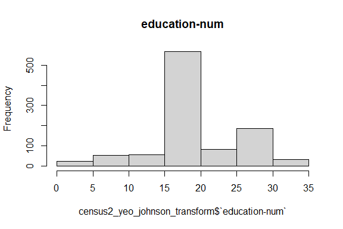<!-- -->

``` r
# Capital-gain
hist(census2_yeo_johnson_transform$`capital-gain`, main = names(census2_yeo_johnson_transform)[which(names(census2_yeo_johnson_transform) == 'capital-gain')])
```

<!-- -->

``` r
# Capital-loss
hist(census2_yeo_johnson_transform$`capital-loss`, main = names(census2_yeo_johnson_transform)[which(names(census2_yeo_johnson_transform) == 'capital-loss')])
```

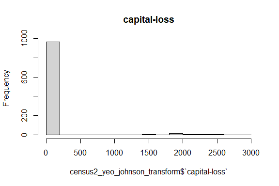<!-- -->

``` r
# hours-per-week
hist(census2_yeo_johnson_transform$`hours-per-week`, main = names(census2_yeo_johnson_transform)[which(names(census2_yeo_johnson_transform) == 'hours-per-week')])
```

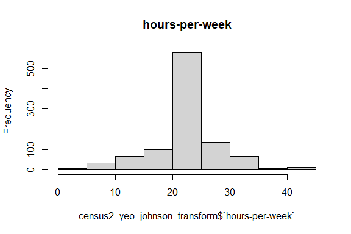<!-- -->

## Linear algebra transforms

### (i) Principal Component Analysis (PCA)

``` r
summary(census2)
```

    ##       age         workclass         education_level    education-num   
    ##  Min.   :17.00   Length:1000        Length:1000        Min.   : 1.000  
    ##  1st Qu.:27.00   Class :character   Class :character   1st Qu.: 9.000  
    ##  Median :37.00   Mode  :character   Mode  :character   Median :10.000  
    ##  Mean   :38.09                                         Mean   : 9.987  
    ##  3rd Qu.:46.00                                         3rd Qu.:12.000  
    ##  Max.   :90.00                                         Max.   :16.000  
    ##  marital-status      occupation        relationship           race          
    ##  Length:1000        Length:1000        Length:1000        Length:1000       
    ##  Class :character   Class :character   Class :character   Class :character  
    ##  Mode  :character   Mode  :character   Mode  :character   Mode  :character  
    ##                                                                             
    ##                                                                             
    ##                                                                             
    ##      sex             capital-gain      capital-loss     hours-per-week 
    ##  Length:1000        Min.   :    0.0   Min.   :   0.00   Min.   : 3.00  
    ##  Class :character   1st Qu.:    0.0   1st Qu.:   0.00   1st Qu.:40.00  
    ##  Mode  :character   Median :    0.0   Median :   0.00   Median :40.00  
    ##                     Mean   :  924.4   Mean   :  70.56   Mean   :41.06  
    ##                     3rd Qu.:    0.0   3rd Qu.:   0.00   3rd Qu.:45.00  
    ##                     Max.   :99999.0   Max.   :2824.00   Max.   :99.00  
    ##  native-country        income         
    ##  Length:1000        Length:1000       
    ##  Class :character   Class :character  
    ##  Mode  :character   Mode  :character  
    ##                                       
    ##                                       
    ## 

``` r
# Exclude 'income' from the variables being scaled
model_of_the_transform <- preProcess(census2[, -14], method = c("scale", "center", "pca"))

print(model_of_the_transform)
```

    ## Created from 1000 samples and 13 variables
    ## 
    ## Pre-processing:
    ##   - centered (5)
    ##   - ignored (8)
    ##   - principal component signal extraction (5)
    ##   - scaled (5)
    ## 
    ## PCA needed 5 components to capture 95 percent of the variance

``` r
census2_pca_dr <- predict(model_of_the_transform, census2)

summary(census2_pca_dr)
```

    ##   workclass         education_level    marital-status      occupation       
    ##  Length:1000        Length:1000        Length:1000        Length:1000       
    ##  Class :character   Class :character   Class :character   Class :character  
    ##  Mode  :character   Mode  :character   Mode  :character   Mode  :character  
    ##                                                                             
    ##                                                                             
    ##                                                                             
    ##  relationship           race               sex            native-country    
    ##  Length:1000        Length:1000        Length:1000        Length:1000       
    ##  Class :character   Class :character   Class :character   Class :character  
    ##  Mode  :character   Mode  :character   Mode  :character   Mode  :character  
    ##                                                                             
    ##                                                                             
    ##                                                                             
    ##     income               PC1                PC2                 PC3          
    ##  Length:1000        Min.   :-8.18335   Min.   :-11.04745   Min.   :-4.20140  
    ##  Class :character   1st Qu.:-0.56193   1st Qu.: -0.33921   1st Qu.:-0.58092  
    ##  Mode  :character   Median : 0.04867   Median : -0.04739   Median :-0.02023  
    ##                     Mean   : 0.00000   Mean   :  0.00000   Mean   : 0.00000  
    ##                     3rd Qu.: 0.67648   3rd Qu.:  0.25398   3rd Qu.: 0.60132  
    ##                     Max.   : 3.37017   Max.   :  4.78363   Max.   : 2.99299  
    ##       PC4                PC5          
    ##  Min.   :-3.33731   Min.   :-3.17716  
    ##  1st Qu.:-0.49871   1st Qu.:-0.51880  
    ##  Median :-0.09255   Median : 0.01282  
    ##  Mean   : 0.00000   Mean   : 0.00000  
    ##  3rd Qu.: 0.39296   3rd Qu.: 0.44625  
    ##  Max.   : 6.30818   Max.   : 6.15883

``` r
dim(census2_pca_dr)
```

    ## [1] 1000   14

#### PCA for Feature Extraction

``` r
census2_pca_fe <- princomp(cor(census2[,c(1,4,10,11,12)]))
summary(census2_pca_fe)
```

    ## Importance of components:
    ##                           Comp.1    Comp.2    Comp.3    Comp.4       Comp.5
    ## Standard deviation     0.4681163 0.4323549 0.3992987 0.3455116 1.971238e-08
    ## Proportion of Variance 0.3199574 0.2729389 0.2327987 0.1743051 5.673655e-16
    ## Cumulative Proportion  0.3199574 0.5928963 0.8256949 1.0000000 1.000000e+00

#### Scree Plot

``` r
factoextra::fviz_eig(census2_pca_fe, addlabels = TRUE)
```

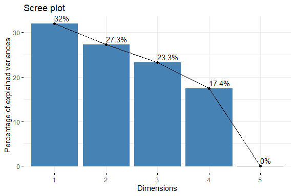<!-- -->

``` r
census2_pca_fe$loadings[, 1:2]
```

    ##                    Comp.1      Comp.2
    ## age             0.2102957  0.68925317
    ## education-num  -0.3079793 -0.39256883
    ## capital-gain   -0.6991166  0.01425491
    ## capital-loss    0.5786920 -0.53752797
    ## hours-per-week  0.1930699  0.28579758

``` r
# it shows the extent to which each variable is represented 
factoextra::fviz_cos2(census2_pca_fe, choice = "var", axes = 1:2)
```

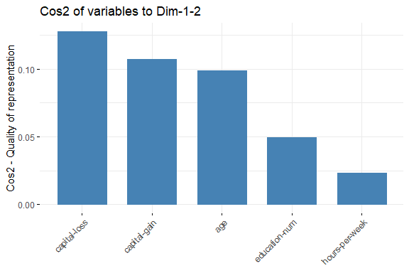<!-- -->

#### Biplot and Cos2 Combined Plot

``` r
factoextra::fviz_pca_var(census2_pca_fe, col.var = "cos2",
                         gradient.cols = c("brown", "orange", "green"),
                         repel = TRUE)
```

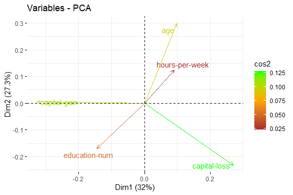<!-- -->

### (ii) Independent Component Analysis (ICA)

``` r
# fastICA
if (!is.element("fastICA", installed.packages()[, 1])) {
  install.packages("fastICA", dependencies = TRUE)
}
require("fastICA")
```

    ## Loading required package: fastICA

``` r
summary(census2)
```

    ##       age         workclass         education_level    education-num   
    ##  Min.   :17.00   Length:1000        Length:1000        Min.   : 1.000  
    ##  1st Qu.:27.00   Class :character   Class :character   1st Qu.: 9.000  
    ##  Median :37.00   Mode  :character   Mode  :character   Median :10.000  
    ##  Mean   :38.09                                         Mean   : 9.987  
    ##  3rd Qu.:46.00                                         3rd Qu.:12.000  
    ##  Max.   :90.00                                         Max.   :16.000  
    ##  marital-status      occupation        relationship           race          
    ##  Length:1000        Length:1000        Length:1000        Length:1000       
    ##  Class :character   Class :character   Class :character   Class :character  
    ##  Mode  :character   Mode  :character   Mode  :character   Mode  :character  
    ##                                                                             
    ##                                                                             
    ##                                                                             
    ##      sex             capital-gain      capital-loss     hours-per-week 
    ##  Length:1000        Min.   :    0.0   Min.   :   0.00   Min.   : 3.00  
    ##  Class :character   1st Qu.:    0.0   1st Qu.:   0.00   1st Qu.:40.00  
    ##  Mode  :character   Median :    0.0   Median :   0.00   Median :40.00  
    ##                     Mean   :  924.4   Mean   :  70.56   Mean   :41.06  
    ##                     3rd Qu.:    0.0   3rd Qu.:   0.00   3rd Qu.:45.00  
    ##                     Max.   :99999.0   Max.   :2824.00   Max.   :99.00  
    ##  native-country        income         
    ##  Length:1000        Length:1000       
    ##  Class :character   Class :character  
    ##  Mode  :character   Mode  :character  
    ##                                       
    ##                                       
    ## 

``` r
model_of_the_transform <- preProcess(census2,
                                     method = c("scale", "center", "ica"),
                                     n.comp = 1)
print(model_of_the_transform)
```

    ## Created from 1000 samples and 14 variables
    ## 
    ## Pre-processing:
    ##   - centered (5)
    ##   - independent component signal extraction (5)
    ##   - ignored (9)
    ##   - scaled (5)
    ## 
    ## ICA used 1 components

``` r
census2_ica_dr <- predict(model_of_the_transform, census2)

summary(census2_ica_dr)
```

    ##   workclass         education_level    marital-status      occupation       
    ##  Length:1000        Length:1000        Length:1000        Length:1000       
    ##  Class :character   Class :character   Class :character   Class :character  
    ##  Mode  :character   Mode  :character   Mode  :character   Mode  :character  
    ##                                                                             
    ##                                                                             
    ##                                                                             
    ##  relationship           race               sex            native-country    
    ##  Length:1000        Length:1000        Length:1000        Length:1000       
    ##  Class :character   Class :character   Class :character   Class :character  
    ##  Mode  :character   Mode  :character   Mode  :character   Mode  :character  
    ##                                                                             
    ##                                                                             
    ##                                                                             
    ##     income               ICA1        
    ##  Length:1000        Min.   :-2.9082  
    ##  Class :character   1st Qu.:-0.5838  
    ##  Mode  :character   Median :-0.0420  
    ##                     Mean   : 0.0000  
    ##                     3rd Qu.: 0.4849  
    ##                     Max.   : 7.0616
